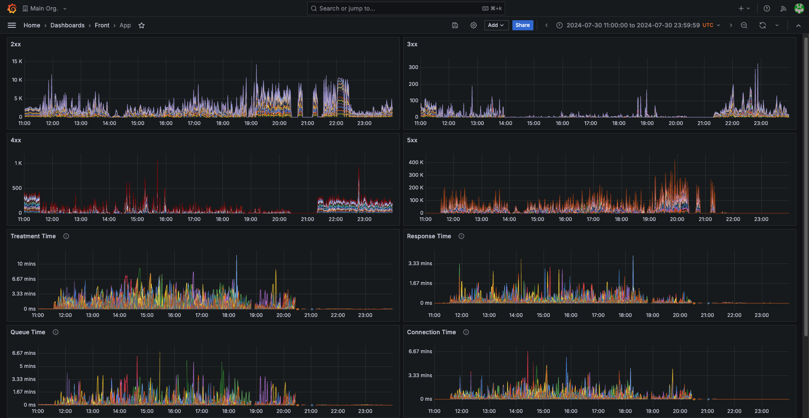
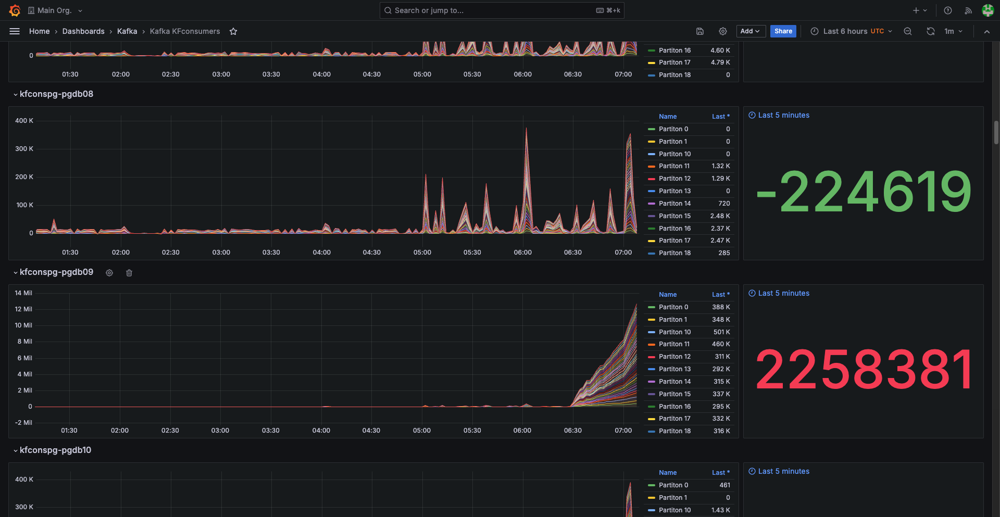

# Monitoring and Observability

This is the dedicated README regarding monitoring. All the needed files are located in this folder (/monitoring).

`monitoring/docker-compose.yml`: It contains the configuration section, but is deliberately incomplete.

## 1. Tool Deployment and Configuration

### Tasks

- **Deploy and configure** Prometheus, Grafana, Alertmanager, Prometheus Node Exporter, and PostgreSQL Exporter to work seamlessly together.
- **Complete the volumes** in the `docker-compose.yml` file to ensure that configuration data persists and can be shared across containers. The general mapping should be from a local file located at `/path/to/local/config.yml` to the corresponding file inside the container at `/path/inside/container/config.yml`.

## 2. Alert Configuration

### Tasks

- **Configure an alert** to trigger when the number of active connections (backends) to the PostgreSQL database exceeds 0 for a continuous duration of 1 second.
- **Set up an additional alert** to monitor the system's CPU usage, triggering when usage exceeds 1% for each instance over a 10-minute period.

## 3. Dashboard Creation:

### Task

Create and integrate dashboards in Grafana to display critical metrics. These metrics should include CPU and memory utilization, as well as PostgreSQL activity metrics such as the number of rows fetched, updated, deleted, and inserted.

## 4. Data analysis

### Task

Analyze the information presented in the provided screenshots below (and available into `screenshots/`) and draw conclusions based on this data.

