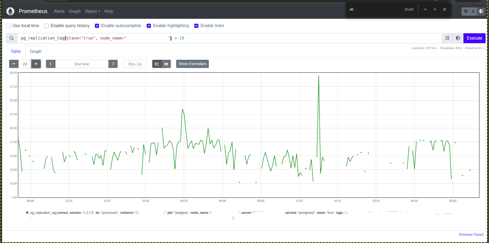
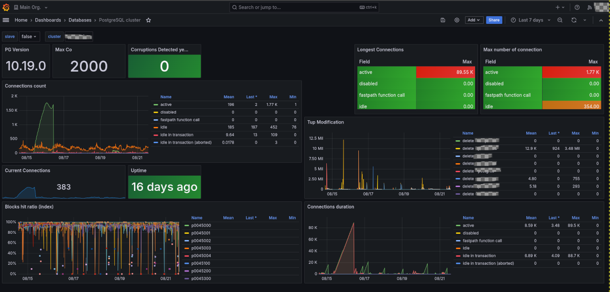
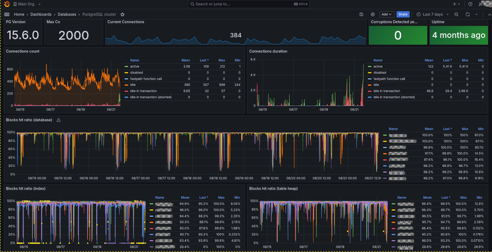

# Production Incident Scenario, Database Management and Optimization

This is the dedicated README regarding database management. All the needed files are located in this folder (/postgres).

`postgres/00_init.sql`: This is the initialization script used to create a replication slot and the corresponding user. This file is mounted to the container's `/docker-entrypoint-initdb.d` directory, which is the default location for database initialization scripts in the postgres:14 image utilized here.

`postgres/docker-compose.yml`: It contains the configuration part.

`postgres/table_dump.sql`: It contains a table that needs to be imported into the database within the container for testing purposes. The container is configured to persist data even after a restart, with the database data mounted on `/var/lib/postgresql/data`.

## 1. Database Architecture and Design

You are responsible for designing a robust database architecture for a platform that processes millions of transactions daily. The architecture must ensure low-latency queries and maintain high availability, even under heavy load and during potential system failures.

### Tasks

- **Propose various database architectures** that support high availability and fault tolerance, detailing their advantages and drawbacks.
- **Identify the architecture** you consider the best choice, providing a clear explanation for your selection.

Please complete the `postgres.md` file with the necessary information.

## 2. Performance Tuning and Query Optimization

### Set up
Before beginning this exercise, import the database into the Docker container using the `table_dump.sql` file.

```bash
docker exec -i <container_name> psql -U user -d postgres < /tmp/table_dump.sql
```

Any modified test tables required in the future can be dumped and exported from the container.


*Note: The following command is only necessary if you want to export the table from the container.*

```bash
docker exec <container> pg_dump -U user -d postgres -t test_data > /tmp/table_dump.sql
```

### Data description

We are providing a table and a query below that you will need to analyze.

Here is the information about the table:

```
postgres=# \d+ new_test_data
                                                                 Table "public.new_test_data"
   Column   |            Type             | Collation | Nullable |                Default                | Storage  | Compression | Stats target | Description 
------------+-----------------------------+-----------+----------+---------------------------------------+----------+-------------+--------------+-------------
 id         | integer                     |           | not null | nextval('test_data_id_seq'::regclass) | plain    |             |              | 
 name       | text                        |           |          |                                       | extended |             |              | 
 email      | text                        |           |          |                                       | extended |             |              | 
 age        | integer                     |           |          |                                       | plain    |             |              | 
 city       | text                        |           |          |                                       | extended |             |              | 
 is_active  | boolean                     |           |          |                                       | plain    |             |              | 
 score      | double precision            |           |          |                                       | plain    |             |              | 
 created_at | timestamp without time zone |           |          | CURRENT_TIMESTAMP                     | plain    |             |              | 
Indexes:
    "test_data_pkey" PRIMARY KEY, btree (id)
Access method: heap
```
```
postgres=# select count (*) from test_data;
  count  
---------
 1000005
(1 row)
```


Here is the query:

```
postgres=# SELECT *
FROM test_data
WHERE LOWER(name) LIKE '%test%'
ORDER BY age DESC
LIMIT 10;
```

### Tasks

- **Analyze the query** and propose optimizations to improve its performance.
- **Suggest indexing strategies** to further enhance the query's efficiency.


## 3. Backup and Disaster Recovery

For all those tasks complete the `postgres.md` file with the necessary information.

### Backup restoration

**Task 1**: Design a backup strategy that ensures regular backups while minimizing performance impact.

**Task 2**: Provide the steps to restore the database in the event of a complete system failure.

### Troubleshooting

Here are some examples of potential issues that could arise during the process. Please analyze and troubleshoot these outputs/errors.


**Task 3**: Upon building a cluster with one replica, when checking the replication lag on the standby, we have encountered the following output. Can you analyze it?

```
postgres=# select now()-pg_last_xact_replay_timestamp() as replication_lag;
 replication_lag 
-----------------
 00:55:00.115093
(1 row)
```

**Task 4**: Below is a screenshot representing the delay:
- What could be the cause of this delay?
- How can this be monitored?
- What are the general strategies for monitoring PostgreSQL?



## 4. Database Security

Security audits have identified potential vulnerabilities in your database setup. You need to ensure that the database is protected from unauthorized access and data breaches.

For all those tasks complete the `postgres.md` file with the necessary information.

### Tasks

- **Recommend comprehensive security measures** to safeguard the database against SQL injection attacks.
- **Discuss best practices** for effectively managing and securing database user permissions.
- **Describe your approach** to encrypting sensitive data stored within the database to ensure its protection and confidentiality.

## 5. Troubleshooting and Incident Response

Here are several incidents that we would like you to troubleshoot. For each issue, please document your findings and solutions in the `postgres.md` file.

**Task 1**:

Here is what we observe on Grafana:





- What database issues should be monitored based on the provided sample?
- How can this dashboard be improved?
- What are the best practices for monitoring PostgreSQL?
- What does the "Blocks Hit Ratio" for indexes represent?
- What is the "Block Hit Ratio" in a Database?
- What is the "Block Hit Ratio" for Heap Tables?
- How to calculate Block Hit Ratio?


**Task 2**:

What might be causing this error, and what are the potential solutions?

```
Aug 19 07:18:40 secondary.node postgres[135986]: [45738-1] 2024-08-19 07:18:40 UTC [135986]: [45731-1] appname= user=, db= LOG:  waiting for WAL to become available at 0/1002000
Aug 19 07:18:45 secondary.node  postgres[450523]: [9-1] 2024-08-19 07:18:45 UTC [450523]: [1-1] appname= user=, db= FATAL:  could not connect to the primary server: connection to server a>
Aug 19 07:18:45 secondary.node  postgres[450523]: [9-2]         connection to server at "primary.node" (10.10.10.00), port 5432 failed: FATAL:  no pg_hba.conf entry for re>
```

**Task 3**:

What could be causing the PostgreSQL service to be down and generating this error in the logs? How can this issue be addressed?

```
psql: connection to server on socket /var/run/postgresql/.s.PGSQL.5432 failed: FATAL:  sorry, too many clients
```
